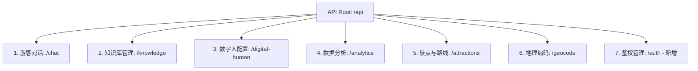

# 景区导览服务AI数字人 - 后端模块接口文档

本接口文档描述了景区导览服务系统的后端 API 设计，包括**现有已实现的接口**，以及为了满足赛题需求**计划新增的接口**（如管理员鉴权、游客满意度评价、个性化画像更新等）。

后端服务默认运行在：`http://localhost:8000/api`

---

## 🔒 统一响应格式 (ApiResponse)

所有普通 HTTP 接口均采用统一的 JSON 格式返回：

```json
{
  "code": 200,
  "message": "success",
  "data": {}
}
```

- `code`: 状态码。`200` 表示成功，`400` 参数错误，`401` 未授权，`404` 资源不存在，`500` 系统内部错误。
- `message`: 状态描述信息。
- `data`: 实际返回的数据体，若无数据则为 `null` 或空对象。

---

## 📂 接口分类概览



---

## 1. 游客对话模块 (/chat)

用于处理游客的文本、语音、图片交互及会话历史查询。

### 1.1 发送文本消息 (单次同步)
- **接口路径**: `POST /chat/text`
- **请求格式**: `Content-Type: application/json`
- **请求体 (ChatRequest)**:
  ```json
  {
    "session_id": "user_xyz123",
    "message": "灵山大佛有多高？",
    "use_rag": true
  }
  ```
- **响应体 (ApiResponse)**:
  ```json
  {
    "code": 200,
    "message": "success",
    "data": {
      "session_id": "user_xyz123",
      "reply": "灵山大佛通高88米，是世界上最高的释迦牟尼露天青铜立像。",
      "emotion": "excited",
      "audio_base64": "UklGRiS..."
    }
  }
  ```

### 1.2 发送文本消息 (流式 SSE)
- **接口路径**: `POST /chat/text/stream`
- **请求格式**: `Content-Type: application/json`
- **请求体**: 同上
- **响应格式**: `text/event-stream`
- **流事件格式**:
  - `data: {"type": "delta", "text": "灵"}`
  - `data: {"type": "delta", "text": "山"}`
  - `data: {"type": "speech", "audio_base64": "UklGR..."}` (文本生成结束后分段推入音频)
  - `data: {"type": "done", "reply": "完整回复内容", "emotion": "excited"}`

### 1.3 发送语音消息
- **接口路径**: `POST /chat/voice`
- **请求格式**: `multipart/form-data`
- **请求参数**:
  - `file`: 录音文件 (WAV/MP3 格式二进制)
  - `session_id`: 字符串（默认为 `default`）
- **响应体 (ApiResponse)**: 返回识别后的回复和语音数据，格式同 `POST /chat/text`。

### 1.4 发送图片识别消息
- **接口路径**: `POST /chat/image`
- **请求格式**: `application/x-www-form-urlencoded` 或 `multipart/form-data`
- **请求参数**:
  - `image_base64`: 图片的 Base64 编码字符串（不含 `data:image/png;base64,` 前缀）
  - `session_id`: 字符串
- **响应体 (ApiResponse)**: 同 `POST /chat/text`。

### 1.5 获取会话历史记录
- **接口路径**: `GET /chat/history/{session_id}`
- **响应体 (ApiResponse)**:
  ```json
  {
    "code": 200,
    "message": "success",
    "data": [
      {
        "id": 12,
        "role": "user",
        "content": "古塔什么时候建的？",
        "emotion": "neutral",
        "time": "14:23"
      },
      {
        "id": 13,
        "role": "assistant",
        "content": "古塔建于唐贞观年间...",
        "emotion": "happy",
        "time": "14:24"
      }
    ]
  }
  ```

---

## 2. 知识库管理模块 (/knowledge)

管理数字人的事实问答知识。**注意：为满足后台安全性要求，后台写操作接口需要鉴权。**

### 2.1 获取问答对列表
- **接口路径**: `GET /knowledge/qa`
- **请求参数**:
  - `search`: 字符串（可选，按问题/答案关键字搜索）
  - `category`: 字符串（可选，按分类过滤）
- **响应体 (ApiResponse)**:
  ```json
  {
    "code": 200,
    "message": "success",
    "data": [
      {
        "id": 1,
        "question": "景区开放时间？",
        "answer": "每天8:00至18:00。",
        "category": "基本信息"
      }
    ]
  }
  ```

### 2.2 创建问答条目 [需要鉴权]
- **接口路径**: `POST /knowledge/qa`
- **请求格式**: `Content-Type: application/json`
- **Headers**: `Authorization: Bearer <token>` (新增)
- **请求体**:
  ```json
  {
    "question": "怎么去灵山大佛？",
    "answer": "可以乘坐乐游2号线公交直达。",
    "category": "交通指南"
  }
  ```
- **响应体**: 创建成功的 QAItem 详情。
- **关联逻辑**: 修复同步调用 `rag_service.add_qa_pair` 实时计算向量入库。

### 2.3 修改问答条目 [需要鉴权]
- **接口路径**: `PUT /knowledge/qa/{qa_id}`
- **Headers**: `Authorization: Bearer <token>`
- **请求体**: QA 部分或全部字段。

### 2.4 删除问答条目 [需要鉴权]
- **接口路径**: `DELETE /knowledge/qa/{qa_id}`
- **Headers**: `Authorization: Bearer <token>`

### 2.5 上传并解析知识文档 [需要鉴权]
- **接口路径**: `POST /knowledge/upload`
- **Headers**: `Authorization: Bearer <token>`
- **请求格式**: `multipart/form-data`
- **请求参数**:
  - `file`: 文档文件（支持 .txt, .docx, .pdf 等）
- **响应体 (ApiResponse)**:
  ```json
  {
    "code": 200,
    "message": "success",
    "data": {
      "name": "灵山胜境游览指南.docx",
      "chunks": 42
    }
  }
  ```

### 2.6 重建向量库索引 [需要鉴权]
- **接口路径**: `POST /knowledge/rebuild`
- **Headers**: `Authorization: Bearer <token>`
- **功能**: 清空现有的本地向量缓存，重新读取上传的所有文档并执行向量化计算。

---

## 3. 数字人配置模块 (/digital-human)

用于读取和保存数字人的外观服装等。

### 3.1 获取数字人基本配置
- **接口路径**: `GET /digital-human/config`
- **响应体**: 返回当前生效的名称、称号、发音人音色、服装、语速等配置信息。

### 3.2 更新数字人基本配置 [需要鉴权]
- **接口路径**: `PUT /digital-human/config`
- **Headers**: `Authorization: Bearer <token>`
- **请求体 (DigitalHumanConfig)**:
  ```json
  {
    "name": "灵儿",
    "title": "金牌数字导游",
    "character_id": "guide1",
    "voice_id": "zh-CN-XiaoyiNeural",
    "outfit_id": "outfit2",
    "speed": 1.1
  }
  ```

---

## 4. 数据统计与感受度报告模块 (/analytics)

展示运营大屏数据、游客情感趋势以及服务改进建议。

### 4.1 获取大屏核心指标统计
- **接口路径**: `GET /analytics/summary`
- **响应数据**:
  ```json
  {
    "positive_ratio": 78.5,
    "neutral_ratio": 15.0,
    "negative_ratio": 6.5,
    "avg_score": 4.7,
    "total_conversations": 942,
    "total_visitors": 245
  }
  ```

### 4.2 获取游客情感满意度走势（近 N 日）
- **接口路径**: `GET /analytics/emotion-trend?days=7`

### 4.3 新增：提交游客感受度评价反馈 (游客端提交通道) [新增]
- **接口路径**: `POST /analytics/feedback`
- **请求格式**: `Content-Type: application/json`
- **请求体**:
  ```json
  {
    "session_id": "user_xyz123",
    "satisfaction": 5,
    "suggestion": "数字人声音很亲切，如果景点历史故事能再讲多点就好了。"
  }
  ```
- **响应体**:
  ```json
  {
    "code": 200,
    "message": "您的评价已收到，感谢您的支持！",
    "data": null
  }
  ```
- **数据流向**: 写入数据库 `visitor_feedback` 表。触发 `analytics_service.get_suggestions` 从用户反馈中分词提取高频关键词并自动分类为 `improve`（待改进建议）。

---

## 5. 景点与路线推荐模块 (/attractions)

用于拉取地图景点和根据兴趣进行个性化推荐。

### 5.1 获取全部景点列表
- **接口路径**: `GET /attractions`

### 5.2 获取游览路线列表
- **接口路径**: `GET /attractions/routes`

### 5.3 兴趣偏好路线推荐
- **接口路径**: `POST /attractions/routes/recommend`
- **请求体**:
  ```json
  {
    "tags": ["history", "photo"]
  }
  ```
- **响应体**: 匹配到的路线列表（由高到低排序）。

---

## 6. 管理员安全鉴权模块 (/auth) [新增]

为了系统安全性，防范非法进入后台修改知识库和数字人外观配置。

### 6.1 管理员登录
- **接口路径**: `POST /auth/login`
- **请求格式**: `Content-Type: application/json`
- **请求体**:
  ```json
  {
    "username": "admin",
    "password": "securepassword123"
  }
  ```
- **响应体 (ApiResponse)**:
  ```json
  {
    "code": 200,
    "message": "登录成功",
    "data": {
      "access_token": "eyJhbGciOiJIUzI1NiIsInR5cCI6IkpXVCJ9.ey...",
      "token_type": "bearer",
      "expires_in": 1800
    }
  }
  ```

---

## ❌ 错误状态码参考表

系统在发生错误时，将返回如下 `code` 编码和对应的 `message`：

| 错误代码 (code) | 消息描述 (message) | 触发场景说明 |
| :--- | :--- | :--- |
| **400** | 请求参数不合法 | 必填字段缺失，例如创建 QA 问答对时未传入问题或答案。 |
| **401** | 未登录或 Token 已过期 | 请求管理后台写接口（如创建/删除 QA，更新配置）时未带 JWT，或 Token 已失效。 |
| **403** | 拒绝访问 | 账号权限不足。 |
| **404** | 请求的资源不存在 | 查询的文档或 QA 问答对 ID 在数据库中无法找到。 |
| **500** | 语音合成服务异常 / LLM 调用失败 | edge-tts 连接超时或 DashScope API 服务受限限流。 |
